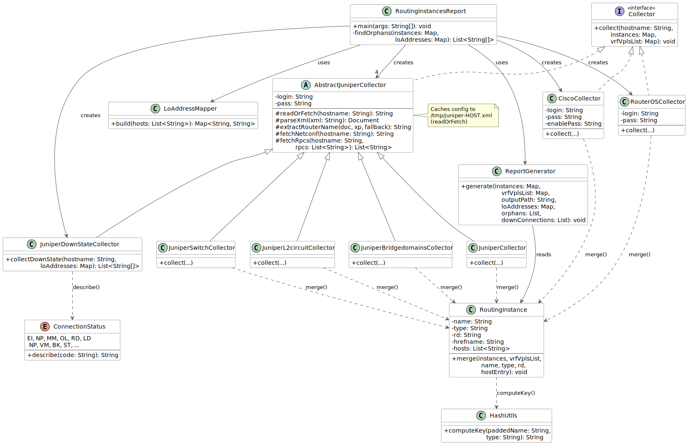

# routing-instances-report

Збирає конфігурацію L2/L3 сервісів з мережевих маршрутизаторів
(Juniper JunOS, Cisco IOS, MikroTik RouterOS) і публікує актуальний HTML-звіт,
що роздається nginx.

## Навіщо

У великих провайдерських мережах десятки або сотні VRF, VPLS-контурів, L2-circuit'ів
і bridge-domain'ів розподілені між маршрутизаторами різних вендорів. Відстежувати,
який сервіс на якому роутері, який у нього Route Distinguisher і до яких інтерфейсів
він прив'язаний, — той ще клопіт. Інструмент опитує кожен маршрутизатор раз на добу,
об'єднує дані в єдину індексовану HTML-сторінку, і будь-хто з NOC-команди може
відкрити браузер і одразу побачити повну картину.

## Як це працює

```
┌─────────────────────────────────────────────────────┐
│  Docker-контейнер                                   │
│                                                     │
│  ┌──────────────────────────┐   ┌─────────────────┐ │
│  │  routing-instances-report│   │      nginx      │ │
│  │  (Java, раз на добу)     │──▶│  роздає HTML    │ │
│  │                          │   │  на порту 80    │ │
│  │  Juniper  ← NETCONF/SSH  │   └─────────────────┘ │
│  │  Cisco    ← Telnet       │                       │
│  │  RouterOS ← SSH exec     │                       │
│  └──────────────────────────┘                       │
└─────────────────────────────────────────────────────┘
```

**Juniper JunOS** — підключається через SSH, відкриває NETCONF-сесію
(RFC 6241, фреймінг NETCONF 1.0 `]]>]]>`), отримує running-конфігурацію одним
з'єднанням на хост і зберігає XML-дамп у `/tmp/juniper-<host>.xml`. Далі чотири
колектори незалежно парсять цей дамп:

| Колектор | XPath | Тип у звіті | Найменування |
|----------|-------|-------------|--------------|
| `JuniperCollector` | `//routing-instances/instance` | `VRF` / `VPLS/L2` / `VPLS/L3` | `instance/name` |
| `JuniperSwitchCollector` | `//protocols/connections/interface-switch` | `SWITCH` | `interface-switch/name` |
| `JuniperL2circuitCollector` | `//protocols/l2circuit/neighbor/interface` | `L2CIRCUIT` | `virtual-circuit-id/ROUTER` |
| `JuniperBridgedomainsCollector` | `//bridge-domains/domain` | `BRIDGE/L2` / `BRIDGE/L3` | `domain/name` |

VPLS та bridge-domain отримують суфікс `/L3` якщо містять елемент `<routing-interface>`, інакше `/L2`.
Деактивовані секції (`inactive="inactive"`) позначаються `(-)` — для SWITCH і L2CIRCUIT після імені
маршрутизатора, для BRIDGE після імені конкретного інтерфейсу.

Для VPLS-інстансів із LDP-сусідами та vpls-id додатково створюється вторинний запис із ключем
`vpls-id/ROUTER (instance-name)`, щоб пов'язані контури були поруч у відсортованій таблиці.

Усі чотири ігнорують вузли всередині `<dynamic-profiles>`.

Після збору всіх даних `LoAddressMapper` читає ті самі XML-дампи і будує словник
`lo0-адреса → ім'я маршрутизатора`. `ReportGenerator` використовує цей словник для
автоматичної заміни IP-адрес сусідів у таблиці: `94.125.120.68` → `RHOH15-1/94.125.120.68`.

**Cisco IOS** — підключається через Telnet, входить у режим enable,
виконує `show running-config`, парсить блоки `ip vrf` / `rd`.

**MikroTik RouterOS** — підключається через SSH, виконує
`/ip route vrf export compact`, парсить вивід із рядками-продовженнями.

Всі дані об'єднуються за складеним ключем (ім'я instance, доповнене до 50
символів + MD5 + SHA-1, сумісне з оригінальною Perl-реалізацією), тому один
VRF, що присутній на кількох маршрутизаторах, відображається одним рядком із
переліком усіх роутерів.

## Звіт

Результуючий HTML містить три індексних розділи, основну таблицю та два аудитних блоки:

- **Список VRF/VPLS за RD** — інстанси з Route Distinguisher, відсортовані за числовим добутком AS×ID,
  з двонаправленими anchor-посиланнями до таблиці;
- **Список VC-ID/VPLS-ID** — записи з іменами вигляду `число/ROUTER` (L2CIRCUIT і вторинні VPLS),
  згруповані за числовим префіксом із кількістю записів на кожен ID; клік переходить
  на перший відповідний рядок таблиці, а рядки таблиці мають зворотне посилання `↑` до списку;
- **Таблиця** — всі зібрані типи з колонками: тип, назва, RD, маршрутизатори;
- **L2CIRCUIT/VPLS без пар** — аудитна таблиця: пари VC-ID/VPLS-ID, для яких на одному кінці є
  запис, а на іншому — відсутній або сусідній маршрутизатор невідомий;
- **L2CIRCUIT/VPLS неактивний стан** — аудитна таблиця down-з'єднань, отриманих через
  NETCONF RPC `get-l2ckt-connection-information<down/>` та `get-vpls-connection-information<down/>`;
  колонки: Тип | Маршрутизатор | VC-ID/VPLS-ID | Instance | Neighbor/Site | Статус.

Сирі XML/config-дампи зберігаються у `$DUMP_DIR/juniper-<host>.xml` і
`/tmp/cisco-<host>.conf` — зручно для налагодження. Juniper-дамп записується
атомарно (write-then-rename), тому читачі ніколи не бачать частково записаного файлу.

## Логування

Застосунок використовує [Log4j2](https://logging.apache.org/log4j/2.x/) (через
Lombok `@Log4j2`). Весь вивід іде до **stdout**, тому Docker перехоплює його
через `docker logs`.

### Рівні логування

| Рівень  | Що логується |
|---------|--------------|
| `INFO`  | Список хостів при старті · підключення до кожного маршрутизатора · кількість розібраних instance · розмір словника lo0-адрес · кількість orphan-записів та down-з'єднань з деталями · шлях до файлу звіту |
| `DEBUG` | Відкриття/закриття NETCONF-сесії · встановлення SSH/Telnet-сесії · кожен окремий `merge` · lo0-адреси словника · шляхи до дампів (`/tmp/juniper-*.xml`, `/tmp/cisco-*.conf`) |
| `WARN`  | Помилки вилучення lo0-адрес з окремих дампів · мінімальний рівень для повідомлень JSch (жорстко задано — прибирає шум SSH-погодження незалежно від `LOG_LEVEL`) |

Orphan-записи та down-з'єднання виводяться в кінці лога, безпосередньо перед
рядком `Writing report to ...`, щоб не губитися серед сотень рядків основної таблиці.

### Керування рівнем логування

Задати змінну оточення `LOG_LEVEL` з будь-яким ім'ям рівня Log4j2
(`trace`, `debug`, `info`, `warn`, `error`). За замовчуванням — `info`.

#### Локальний одноразовий запуск

```bash
LOG_LEVEL=debug java -jar target/routing-instances-report-1.0.jar
```

#### docker run — на передньому плані (одноразово, зручно для діагностики одного роутера)

```bash
docker run --rm \
  -e ROUTER_USER=username \
  -e ROUTER_PASS=password4username \
  -e CISCO_ENABLE=password4enable \
  -e JUNIPER_HOSTS="r560-1" \
  -e LOG_LEVEL=debug \
  --entrypoint java \
  routing-instances-report \
  -jar /usr/local/bin/routing-instances-report.jar
```

#### docker run — фоновий контейнер з DEBUG, потім стежити за логами

```bash
docker run -d \
  --name routing-report \
  -p 80:80 \
  -e ROUTER_USER=username \
  -e ROUTER_PASS=password4username \
  -e CISCO_ENABLE=password4enable \
  -e JUNIPER_HOSTS="r560-1,rhoh15-1,r234-1,r201-1,r525-1,r559-1,r540-1,r418-1,rf102z-1,rdc-1" \
  -e CISCO_HOSTS="rdnepr-1" \
  -e LOG_LEVEL=debug \
  routing-instances-report

docker logs -f routing-report
```

#### docker-compose — додати один рядок у блок environment

```yaml
environment:
  LOG_LEVEL: debug
```

## Діаграма класів



Діаграма і Javadoc перегенеруються однією командою:

```bash
mvn -P docs generate-resources
# результат: docs/classes.svg  (PlantUML)
#            target/reports/apidocs/  (Javadoc)
```

Потребує Java і доступу до інтернету для завантаження `plantuml.jar` (один раз,
кешується у `~/.m2/`). Graphviz встановлювати не потрібно на macOS/Windows;
на Linux: `sudo apt install graphviz` або `sudo dnf install graphviz`.

## Структура проєкту

```
routing-instances-report/
├── Dockerfile                           багатоетапне збирання (JDK 21 → nginx + JRE 21)
├── pom.xml                              Maven-збирання (fat JAR через maven-shade-plugin)
├── bin/
│   └── routing-instances-report.sh     добовий цикл (запускає JAR, спить 24 год)
├── docker-entrypoint.d/
│   └── 40-routing-instances-report.sh  запускається entrypoint nginx у фоні
└── src/main/java/net/ukrhub/routing/instances/report/
    ├── RoutingInstancesReport.java      головний клас — читає env vars, керує збиранням,
    │                                    перевіряє orphan-пари (findOrphans)
    ├── RoutingInstance.java             модель даних (@Data Lombok) + статичний merge()
    ├── HashUtils.java                   складений ключ MD5 + SHA-1 (сумісний з Perl)
    ├── Collector.java                   інтерфейс — void collect(host, instances, vrfVplsList)
    ├── AbstractJuniperCollector.java    базовий клас: NETCONF транспорт (fetchRpcs, fetchNetconf,
    │                                    readOrFetch) + XML/hostname хелпери
    ├── JuniperCollector.java            routing-instances (VRF, VPLS/L2, VPLS/L3)
    ├── JuniperSwitchCollector.java      connections/interface-switch (SWITCH)
    ├── JuniperL2circuitCollector.java   l2circuit/neighbor/interface (L2CIRCUIT)
    ├── JuniperBridgedomainsCollector.java bridge-domains/domain (BRIDGE/L2, BRIDGE/L3)
    ├── JuniperDownStateCollector.java   get-l2ckt-connection-information<down/> +
    │                                    get-vpls-connection-information<down/> в одній NETCONF-сесії
    ├── ConnectionStatus.java            enum статус-кодів L2CIRCUIT/VPLS з людиночитаним описом
    ├── LoAddressMapper.java             lo0 IP → ім'я маршрутизатора зі збережених дампів
    ├── CiscoCollector.java              Telnet, show running-config
    ├── RouterOSCollector.java           SSH exec, /ip route vrf export compact
    └── ReportGenerator.java            генератор HTML-звіту з трьома індексами та двома аудитними таблицями
```

## Змінні оточення

| Змінна           | Обов'язкова      | Опис |
|------------------|------------------|------|
| `ROUTER_USER`    | **так**          | SSH / Telnet логін для всіх маршрутизаторів |
| `ROUTER_PASS`    | **так**          | SSH / Telnet пароль |
| `CISCO_ENABLE`   | якщо є Cisco     | Cisco enable (privileged) пароль |
| `JUNIPER_HOSTS`  | ні               | Juniper-хости через кому |
| `CISCO_HOSTS`    | ні               | Cisco-хости через кому |
| `ROUTEROS_HOSTS` | ні               | MikroTik-хости через кому |
| `REPORT_PATH`    | ні               | Шлях до HTML-файлу звіту (за замовчуванням: `/usr/share/nginx/html/index.html`) |
| `DUMP_DIR`       | ні               | Каталог для XML-дампів Juniper (за замовчуванням: `/tmp`) |
| `LOG_LEVEL`      | ні               | Рівень Log4j2: `trace` `debug` `info` `warn` `error` (за замовчуванням: `info`) |
| `OPENCHANNEL`    | ні               | Тип SSH-каналу для Juniper: `subsystem-netconf` (за замовчуванням) або `exec` |

## Збирання

```bash
mvn package -DskipTests
# створює target/routing-instances-report-1.0.jar
```

## Docker

### Зібрати образ

```bash
docker build -t routing-instances-report .
```

### Запустити

```bash
docker run -d \
  --name routing-report \
  -p 80:80 \
  -e ROUTER_USER=username \
  -e ROUTER_PASS=password4username \
  -e CISCO_ENABLE=password4enable \
  -e JUNIPER_HOSTS="r560-1,rhoh15-1,r234-1,r201-1,r525-1,r559-1,r540-1,r418-1,rf102z-1,rdc-1" \
  -e CISCO_HOSTS="rdnepr-1" \
  routing-instances-report
```

Звіт доступний за адресою `http://<host>/` і оновлюється автоматично раз на добу.
Перший запуск відбувається через кілька секунд після старту контейнера.

### Приклад docker-compose

```yaml
services:
  routing-report:
    build: .
    restart: unless-stopped
    ports:
      - "80:80"
    environment:
      ROUTER_USER:   username
      ROUTER_PASS:   password4username
      CISCO_ENABLE:  password4enable
      JUNIPER_HOSTS: "r560-1,rhoh15-1,r234-1,r201-1,r525-1,r559-1,r540-1,r418-1,rf102z-1,rdc-1"
      CISCO_HOSTS:   "rdnepr-1"
      # LOG_LEVEL: debug
```

## Залежності

| Бібліотека | Призначення |
|------------|-------------|
| [com.github.mwiede/jsch](https://github.com/mwiede/jsch) | SSH-транспорт для Juniper NETCONF і RouterOS |
| [commons-net](https://commons.apache.org/proper/commons-net/) | Telnet-клієнт для Cisco IOS |
| [Lombok](https://projectlombok.org/) | Скорочення шаблонного коду (`@Data` на `RoutingInstance`) |

## Ліцензія

Дивись [LICENSE](LICENSE).
